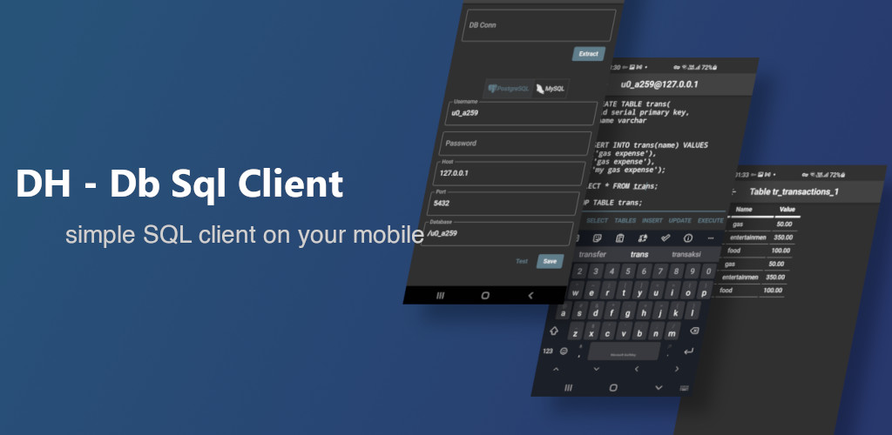

Just SQL client that should be help developer to check the data in the database.

### Why create another SQL Client

In computer I use DBeaver to do the query. And can't find similar app in mobile that
have have that functionality. This is attempt to create that behaviour in mobile, so 
we can query on the road.

### Want to try the app?

